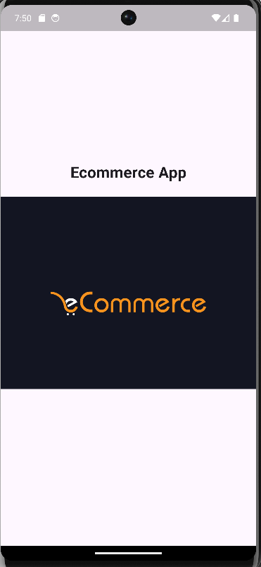
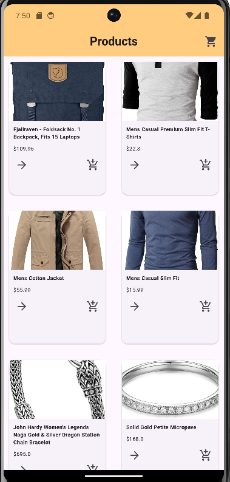
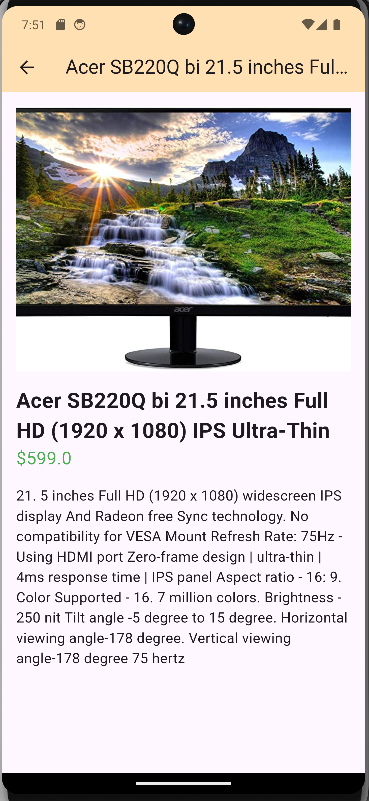
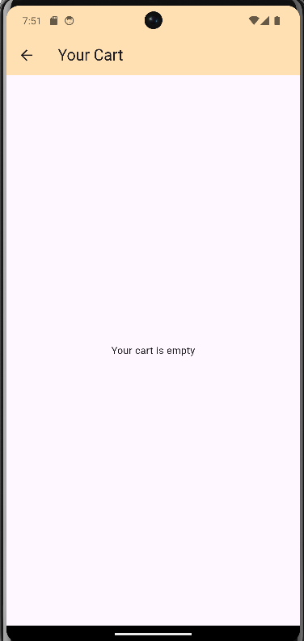
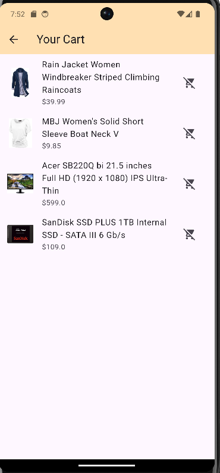
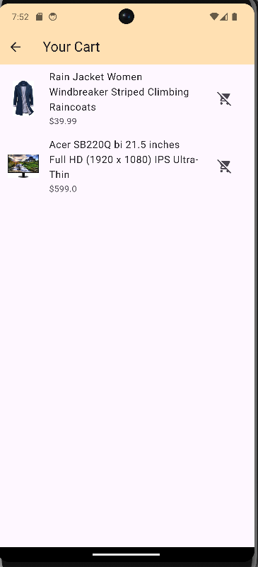

🛍️ E-commerce App

Overview

The E-commerce App is a Flutter application designed to provide users with a seamless online shopping experience. The app includes features like a Splash Screen, Home Screen with GridView displaying products, Product Detail Screen, and a Cart Screen where users can add or remove products. The cart functionality is managed using Shared Preferences, ensuring that users' cart data is saved even after closing the app.

📱 Features

✅ 1. Splash Screen
A visually appealing splash screen that appears for 3 seconds when the app launches.
After 3 seconds, it automatically navigates to the Home Screen.

✅ 2. Home Screen (Grid Display of Products)

GridView displaying products with images, names, and prices.
Clicking on any product navigates the user to the Product Detail Screen.
Clean and attractive UI design with a modern layout.

✅ 3. Product Detail Screen

Displays detailed information about the selected product, including:
Product Image
Product Name
Product Description
Product Price
Provides an Add to Cart button.
If the product is already in the cart, it shows the option to Remove from Cart.

✅ 4. Cart Screen (Add/Remove Functionality)

The Cart Screen displays all the products added by the user.
Users can:
Increase or Decrease the quantity of products.
Remove a product from the cart.
The cart data is stored using Shared Preferences, ensuring data persists even after app closure.

🖼 Screenshots

✅ 5. Shared Preferences Integration

Cart data (product ID, name, price, quantity) is stored in Shared Preferences.
This allows the cart data to persist even if the app is closed and reopened.
Shared Preferences manage:
Add Product to Cart
Remove Product from Cart
Update Quantity

✅ 6. Data Structure Used

The app uses a simple data structure like a Product Model for managing product data and a Cart Model for managing cart data.

📊 App Flow

1. App Launch:
The app launches and displays the Splash Screen.
After 3 seconds, it navigates to the Home Screen.
2. Home Screen:
Products are displayed in GridView.
Tapping a product navigates to the Product Detail Screen.
3. Product Detail Screen:
The product's details are displayed.
The user can add the product to the cart or remove it.
Clicking Add to Cart saves the product in Shared Preferences.
4. Cart Screen:
The user can view the list of products in the cart.
Options to:
Increase/Decrease quantity.
